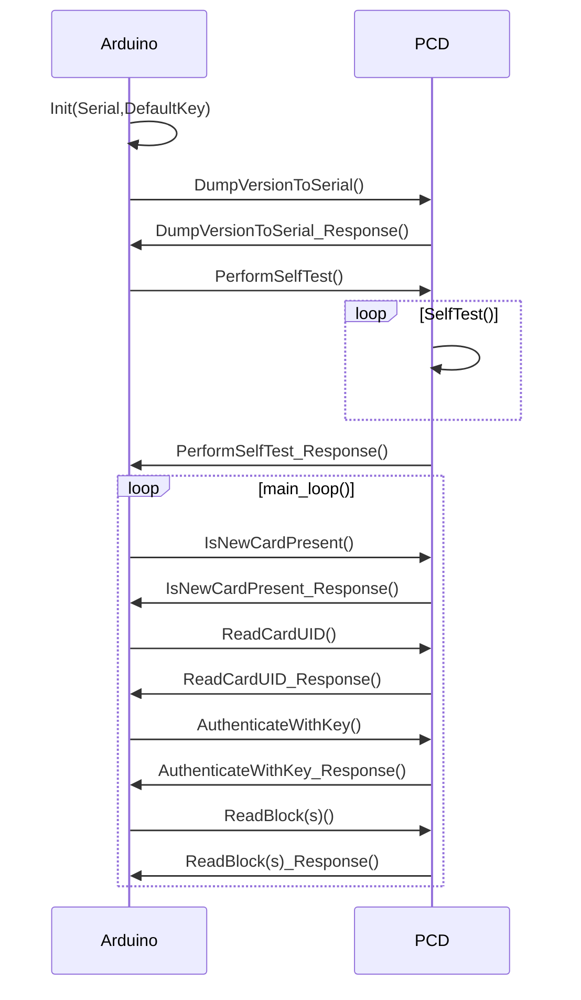

# Diagrams

```mermaid

sequenceDiagram

Arduino ->> Arduino: Init(Serial,DefaultKey)
Arduino ->> PCD: DumpVersionToSerial()
PCD ->> Arduino: DumpVersionToSerial_Response()
Arduino ->> PCD: PerformSelfTest()
loop SelfTest()
    PCD ->> PCD: 
end
PCD ->> Arduino: PerformSelfTest_Response()

loop main_loop()
    Arduino ->> PCD: IsNewCardPresent()
    PCD ->> Arduino: IsNewCardPresent_Response()
    Arduino ->> PCD: ReadCardUID()
    PCD ->> Arduino: ReadCardUID_Response()
    Arduino ->> PCD: AuthenticateWithKey()
    PCD ->> Arduino: AuthenticateWithKey_Response()
    Arduino ->> PCD: ReadBlock(s)()
    PCD ->> Arduino: ReadBlock(s)_Response()
end

```