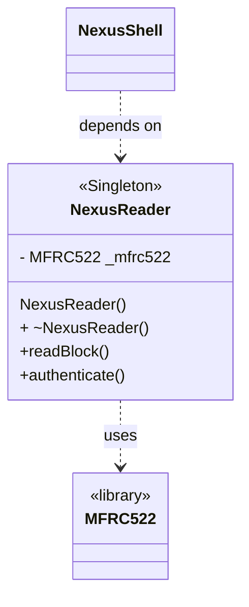
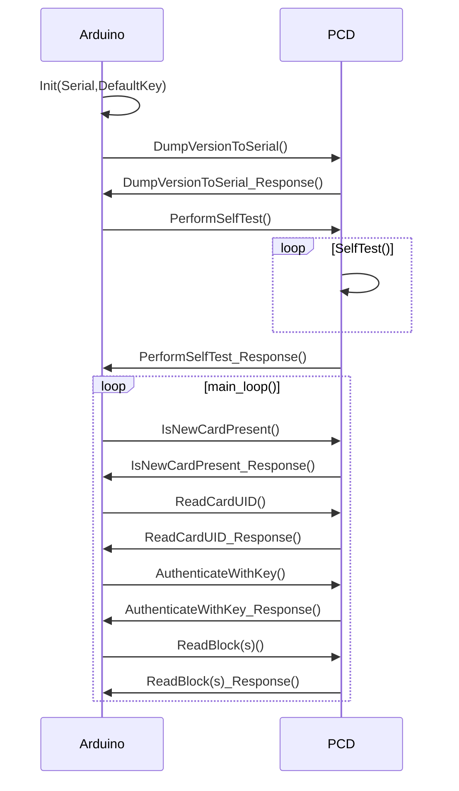
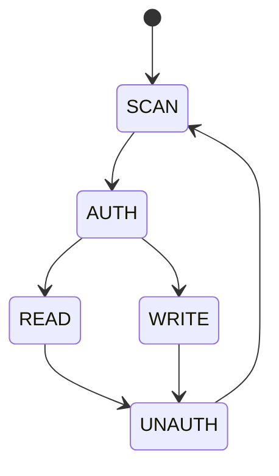

# Diagrams

## Class Diagram

```mermaid
classDiagram


    class NexusReader{
    <<Singleton>>
    NexusReader()
    + ~NexusReader()

    +readBlock()
    +authenticate()

    - MFRC522 _mfrc522
    }

    class NexusShell{
    
    }
    class MFRC522{
        <<library>>
    }

    NexusShell ..> NexusReader : depends on
    NexusReader ..> MFRC522 : uses

```

## Sequence Diagram for a typical program flow

```mermaid

sequenceDiagram

Arduino ->> Arduino: Init(Serial,DefaultKey)
Arduino ->> PCD: DumpVersionToSerial()
PCD ->> Arduino: DumpVersionToSerial_Response()
Arduino ->> PCD: PerformSelfTest()
loop SelfTest()
    PCD ->> PCD: 
end
PCD ->> Arduino: PerformSelfTest_Response()

loop main_loop()
    Arduino ->> PCD: IsNewCardPresent()
    PCD ->> Arduino: IsNewCardPresent_Response()
    Arduino ->> PCD: ReadCardUID()
    PCD ->> Arduino: ReadCardUID_Response()
    Arduino ->> PCD: AuthenticateWithKey()
    PCD ->> Arduino: AuthenticateWithKey_Response()
    Arduino ->> PCD: ReadBlock(s)()
    PCD ->> Arduino: ReadBlock(s)_Response()
end

```

## State Machine

```mermaid
stateDiagram

    [*] --> SCAN
    %% CHECK --> CHECK
    SCAN --> AUTH
    %% AUTH --> AUTH
    AUTH --> READ
    AUTH --> WRITE
    READ --> UNAUTH
    WRITE --> UNAUTH
    UNAUTH --> SCAN

```